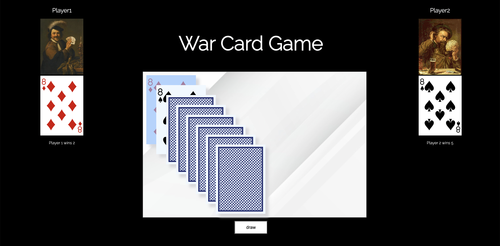

# Responsive Gallery Portfolio

## Description

The objective of the game is to win all of the cards.

The deck is divided evenly among the players, giving each a down stack. In unison, each player reveals the top card of their deck—this is a "battle"—and the player with the higher card takes both of the cards played and moves them to their stack. Aces are high, and suits are ignored.

If the two cards played are of equal value, then there is a "war". Both players place the next three cards face down and then another card face-up. The owner of the higher face-up card wins the war and adds all the cards on the table to the bottom of their deck. If the face-up cards are again equal then the battle repeats with another set of face-down/up cards. This repeats until one player's face-up card is higher than their opponent's.
For seeing a video for how to play [click here!](https://youtu.be/J5vT33Vo04s)

### Screen Shot



### Installation
```sh
  npm install 
  ```

### Technologies Used
- Html
- CSS
- Google Fonts
- Bootstrap

### Getting Started

To see this game, [click here](https://farnaztowhidi.github.io/warCardGame/)

### User Stories
1. As a user, I want to view a gallery of images on the index page so that I can browse through the visual content displayed on the website.
2. As a user, I want to click on an image from the gallery so that I can see a larger version of it, along with additional details or a description.
3. As a user, I want to fill out a contact form with my name, email, and message so that I can send an inquiry or feedback to the website owner.

### Wireframe


### Next Steps
1. Introduce image categories (e.g., nature, architecture, portraits) and filtering options, allowing users to easily browse and filter the gallery based on their interests.
2. Implement user accounts, enabling users to log in and create personalized galleries by marking images as favorites or saving them for future viewing.
3. Add a search bar that allows users to search for specific images or keywords, improving navigation and making it easier to find specific content within the gallery.


## Author
Farnaz Towhidi - [@Linkedin](https://www.linkedin.com/in/farnaz-towhidi-12979665/)

